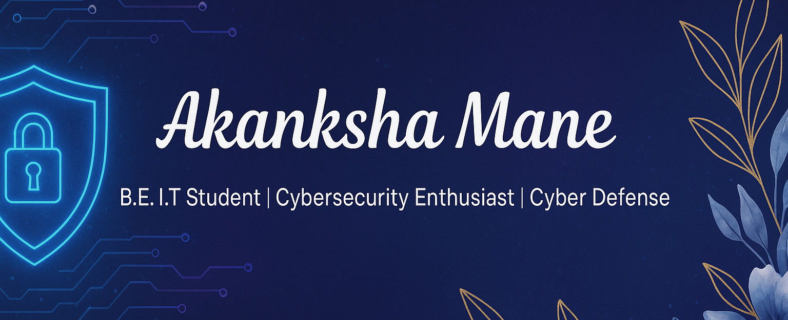

<!-- Banner -->

<!-- Header Name -->
# ɪ'ᴍ ᴀᴋᴀɴᴋsʜᴀ!  
*B.E. I.T. Student | Cybersecurity Enthusiast*  
 
<!-- Right-side Image -->

  

<!-- Intro -->

  I am a <strong>BE Information Technology student</strong> at Yadavrao Tasgaokar College of Engineering & Management.  
  My focus areas include <strong>defensive security, AI-powered security tools, vulnerability analysis, and public infrastructure protection</strong>.  

- 🔐 Exploring **Blue Teaming & Threat Mitigation**  
- 🤖 Building **AI-driven Security Tools**  
- 🌱 Learning **Advanced Penetration Testing, Cloud Security & Forensics**  
- 💡 Passionate about **AI × Security Intersections**  
- 🎯 Striving to **Advance Cyber Defense & Digital Trust**  

---

<!-- Tech Stack Section -->
<h2 align="center">🛠 Tᴇᴄʜ sᴛᴀᴄᴋ & Lᴀᴛᴇsᴛ ʙʟᴏɢs</h2> 

<picture>
  <source media="(prefers-color-scheme: dark)" srcset="./Skills_Animation_Dark.gif">
  <source media="(prefers-color-scheme: light)" srcset="./Skills_Animation_White.gif">
  
</picture>
 

<h3 align="left">📚 Current Learning</h3>
<ul align="left">
  <li>Defensive Security (Blue Team Operations)</li>
  <li>AI for Threat Detection & Mitigation</li>
  <li>Cloud Security & Forensics</li>
</ul>
  
<h3 align="left">📝 Latest Blog Posts</h3>
<ul align="left">
  <li><a href="https://medium.com/@secbyakanksha/how-ai-can-transform-cyber-defense-3205d942ba30">🔥 How AI Can Transform Cyber Defense</a></li>
  <li><a href="https://medium.com/@secbyakanksha/why-mobile-apps-do-more-than-desktop-a-security-perspective-007faf71df83">🔐 Why Mobile Apps Do More Than Desktop — A Security Perspective</a></li>
  <li><a href="https://medium.com/@secbyakanksha/ai-browsers-smart-fast-and-a-bit-too-curious-ee0d8e0e8863">🛡️ AI Browsers: Smart, Fast, and a Bit Too Curious</a></li>
</ul>
    

---

<!-- Music Section -->
<h2 align="center">🎶 Mᴜsɪᴄ & Fʟᴏᴡ 🎶</h2>

Here’s what I code & research with 🎧

  

---

<!-- Quote of the Day -->
<h2 align="center">🌟 Tʜᴏᴜɢʜᴛ ᴏғ ᴛʜᴇ Dᴀʏ 🌟</h2>

  

---

<!-- Connect With Me -->
<h2 align="center">🤝 Cᴏɴɴᴇᴄᴛ Wɪᴛʜ Mᴇ 🤝</h2>

  

 

<!-- Footer -->

  

